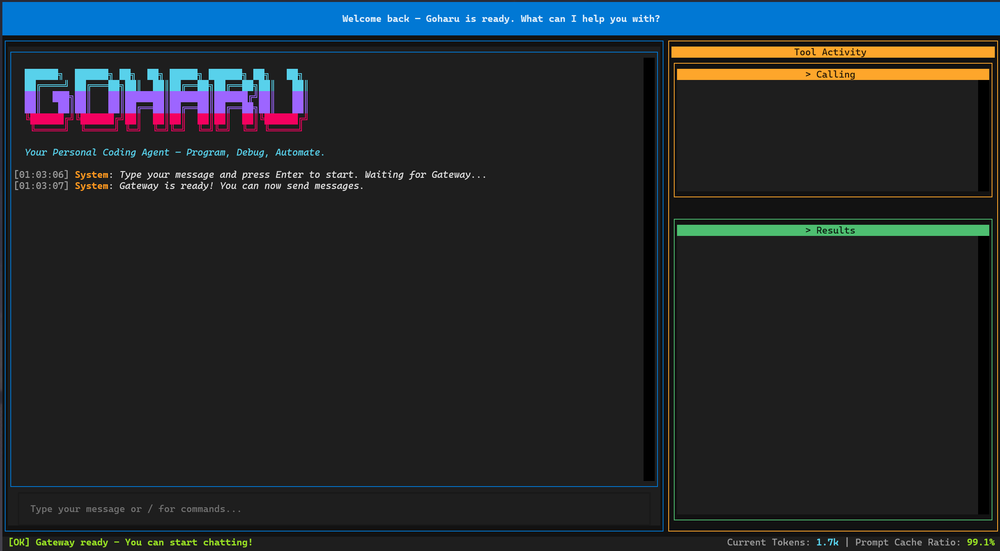

<p align="center">
  <a href="#chinese">中文</a> | <a href="#english">English</a>
</p>

<p align="center">
  
  
  
  
</p>

<p align="center">
  
</p>

<h1 align="center">
  <pre>
  ██████╗  ██████╗ ██╗  ██╗ █████╗ ██████╗ ██╗   ██╗
  ██╔════╝ ██╔═══██╗██║  ██║██╔══██╗██╔══██╗██║   ██║
  ██║  ███╗██║   ██║███████║███████║██████╔╝██║   ██║
  ██║   ██║██║   ██║██╔══██║██╔══██║██╔══██╗██║   ██║
  ╚██████╔╝╚██████╔╝██║  ██║██║  ██║██║  ██║╚██████╔╝
   ╚═════╝  ╚═════╝ ╚═╝  ╚═╝╚═╝  ╚═╝╚═╝  ╚═╝ ╚═════╝
  </pre>
</h1>

<p align="center">
  一个多功能的编程与电脑助手。<br>
  A multi-functional coding &amp; computer assistant.
</p>

---

<span id="chinese"></span>

## 中文文档

### Goharu 是什么？

**Goharu** 是一个基于大语言模型（兼容 Anthropic API）的终端编程 Agent。它运行在 ReAct 循环中——思考 → 行动 → 观察 → 回答——在真实的文件系统和 Shell 上操作真实工具。它不是聊天机器人，它是一个**会做事的 Agent**。

#### 核心能力

| 能力 | 说明 |
|---|---|
| **文件操作** | 读取、写入、diff 式编辑（Write / Read / Edit），带权限门控 |
| **Shell 执行** | 运行任意命令，带多层安全防火墙 |
| **子 Agent 委托** | 派生子 Agent 进行探索、规划、验证 |
| **PDF 解析** | 提取 PDF 中的文本和表格，支持 OCR 回退 |
| **记忆金字塔** | L0→L1→L2→L3 长短期记忆体系，混合检索（BM25 + 向量 + 全文搜索） |
| **多平台接入** | TUI 终端、QQ Bot、ACP/HTTP 协议——三种入口，共享同一大脑 |
| **技能系统** | 预制 SOP 范式：论文分析、引文、绘图、学术润色、审稿回复 |
| **后台任务** | 长时间工具调用转入后台异步执行，完成后自动唤醒 Agent |

#### 架构总览

Goharu 采用分层架构。入口层支持三种接入方式：`run_tui.py`（终端 TUI）、QQ Bot、ACP/HTTP 协议。TUI 通过 JSON-RPC 与 Gateway 后端通信，Gateway 将请求转发给 Actor Agent。Agent 运行 ReAct 循环（思考 → 工具 → 观察 → 回答），内部由 PromptAssembler → LLMCore → ToolRuntime 串联。下层依赖三大系统：工具层（9 个内置模块）、记忆系统（L0→L3 金字塔 + 混合检索）、子 Agent（探索/规划/验证）。

#### 记忆金字塔

记忆系统分四层：**L0** = SQLite 中的原始消息；**L1** = 每 5 轮对话提取一次的记忆原子（JSON + 向量嵌入）；**L2** = 从 L1 原子聚合的场景上下文（scene_blocks/*.md），延迟 90 秒触发；**L3** = 用户画像（persona.md），当累计 50+ 个新 L1 原子时生成。

检索融合 **BM25**（结巴中文分词）+ **FTS5**（SQLite 全文搜索）+ **向量嵌入**，三路召回。

---

### 项目结构

```
Goharu/
├── Agent/                    # 核心 Agent 智能
│   ├── ActorAgent.py         #   ReAct 循环：思考 → 工具 → 观察 → 回答
│   ├── LLMCore.py            #   Anthropic 兼容 API 单例
│   ├── SubAgent.py           #   子 Agent 委托（探索/规划/验证）
│   ├── SummarizerAgent.py    #   L1 记忆原子提取
│   ├── PipelineManager.py    #   L0→L1→L2→L3 管道编排
│   ├── BackgroundTaskManager.py  # 异步后台任务管理
│   ├── MicroCompactor.py     #   旧工具结果折叠压缩
│   └── ContextCompactor.py   #   长对话自动摘要
│
├── Memory/                   # 长期记忆系统
│   ├── MemoryManager.py      #   外观接口：工作记忆 + 检索 + 画像
│   ├── WorkingMemory.py      #   短期记忆：每日 JSON + SQLite 双写
│   ├── retrieval/
│   │   └── HybridRetriever.py    # BM25 + 向量 + FTS 混合检索
│   └── pipeline/
│       ├── SceneExtractor.py     # L2 场景聚合
│       └── PersonaGenerator.py   # L3 用户画像生成
│
├── Tools/                    # 进程内工具运行时
│   ├── builtin/
│   │   ├── core_tools.py     #   run_cmd 命令执行、知识管理
│   │   ├── file_tools.py     #   文件写、读、编辑（diff 式）、搜索
│   │   ├── pdf_tools.py      #   PDF 解析（含 OCR）
│   │   ├── agent_delegate.py #   子 Agent 委托
│   │   ├── skill_tool.py     #   预制技能 SOP 加载
│   │   ├── snip_tool.py      #   按 ID 引用历史消息
│   │   └── glob_tool.py      #   Glob 文件搜索
│   ├── security.py           #   命令安全检查器
│   └── registry.py           #   工具注册表单例
│
├── Prompting/                # 提示词组装管道
│   ├── PromptAssembler.py    #   构建完整 Agent 提示词（SOUL + L1/L2/L3 + 历史）
│   ├── PromptLoader.py       #   加载 Markdown 提示词模板
│   └── PromptRenderer.py     #   渲染 PromptDocument → LLM 消息
│
├── TUI/                      # 终端用户界面 (Textual)
│   ├── app.py                #   主 TUI 应用
│   ├── gateway_entry.py      #   后端子进程入口
│   └── widgets/
│       ├── chat_panel.py     #   流式消息展示
│       ├── tool_panel.py     #   实时工具调用与结果视图
│       └── status_bar.py     #   状态栏、Token 统计
│
├── Gateway/                  # 多平台消息网关
│   ├── session.py            #   多用户会话管理
│   └── platforms/            #   QQ、ACP 适配器
│
├── Core/                     # 共享数据结构
│   ├── Config.py             #   类型化数据类
│   ├── Message.py            #   带来源追踪的核心消息
│   └── LogManager.py         #   集中日志管理
│
├── Skills/                   # 预制技能范式
├── prompts/                  # Markdown 提示词模板
├── config.yaml               # 主配置文件
├── requirements.txt          # Python 依赖
└── run_tui.py                # ▶ 主入口
```

---

### 安装

#### 前置条件

- **Python 3.10+**
- **兼容 Anthropic 的 API Key**（Claude API、MiniMax 或任意兼容提供商）
- **Tesseract OCR**（可选，PDF OCR 功能需要）

#### 快速开始

```bash
# 1. 克隆仓库
git clone https://github.com/your-org/Goharu.git
cd Goharu

# 2. 安装依赖
pip install -r requirements.txt

# 3. 设置 API Key 环境变量
# Windows PowerShell:
$env:ANTHROPIC_API_KEY="your-api-key-here"
# Linux / macOS:
export ANTHROPIC_API_KEY="your-api-key-here"

# 4. 启动
python run_tui.py
```

base_url、模型等参数在 `config.yaml` → `model.large-language-model` 中配置。

---

### 使用

#### TUI 界面

TUI 采用左右分栏布局：左侧为对话面板（流式消息、思考过程、最终回答），右侧为工具面板（实时工具调用、执行结果、错误、后台任务状态）。底部状态栏显示连接状态、工具数量和 Token 统计。

| 快捷键 | 功能 |
|---|---|
| `Ctrl+C` | 退出 |
| `Ctrl+L` | 清空对话 |
| `Ctrl+H` | 切换帮助 |
| `Esc` | 中断 Agent |
| `Tab` | 切换焦点 |

#### 使用示例

```
You: 帮我写一个冒泡排序的 Python 实现，并测试它

Goharu: 好的，我来创建实现和测试文件。

  [Tool: Write]  → 创建 bubble_sort.py
  [Tool: Write]  → 创建 test_bubble_sort.py
  [Tool: run_cmd]  → 运行测试

  测试全部通过。冒泡排序已实现在 bubble_sort.py 中。
```

---

### 安全机制

Goharu 在本地运行所有工具，带**多层安全体系**：

- **命令安全检查器**：阻止危险命令执行（shutdown、rm -rf、format、diskpart、reg delete、powershell -enc 等）
- **文件操作拦截**：Shell 中的文件操作命令（echo/cat/sed/awk 等）被主动拦截，引导使用专用文件工具
- **权限门控**：编辑前必须先读取；写入拒绝覆盖已存在文件
- **全程可配**：所有安全规则定义在 `config.yaml` → `tools.security`

---

### 设计理念

- **模块化**：组件小而专注，职责清晰，易于理解和维护
- **可配置**：从模型选择到记忆阈值，一切尽在 `config.yaml`
- **可观测**：每层都有全面日志——Agent、工具、记忆、TUI
- **最简开发**：按需添加复杂度，拒绝过度设计
- **安全第一**：工具不能绕过文件权限或执行破坏性命令

---

<span id="english"></span>

## English

### What is Goharu?

**Goharu** is a terminal-based Coding Agent powered by large language models (Anthropic-compatible API). It operates in a ReAct loop — Think → Act → Observe → Answer — wielding real tools on your filesystem and shell. It is not a chatbot. It is an agent that *does things*.

#### Core Capabilities

| Capability | Description |
|---|---|
| **File Operations** | Read, Write, and patch-style Edit (like `git diff`) with permission gating |
| **Shell Execution** | Run arbitrary commands with a multi-layer security firewall |
| **Sub-Agent Delegation** | Spawn sub-agents for exploration, planning, and verification |
| **PDF Parsing** | Extract text and tables from PDFs, with OCR fallback |
| **Memory Pyramid** | L0→L1→L2→L3 long-term memory with hybrid retrieval (BM25 + Embedding + FTS) |
| **Multi-Platform** | TUI, QQ Bot, and ACP HTTP Protocol — three access modes, one brain |
| **Skills System** | Pre-built SOPs: paper analysis, citation, figure generation, academic polishing |
| **Background Tasks** | Long-running tool calls go async; agent reactivates when they complete |

#### Architecture at a Glance

Goharu uses a layered architecture. The entry layer supports three access modes: `run_tui.py` (terminal TUI), QQ Bot, and ACP/HTTP protocol. The TUI communicates with the Gateway backend via JSON-RPC, and the Gateway routes requests to the Actor Agent. The Agent runs a ReAct loop (Think → Tools → Observe → Answer), internally wired as PromptAssembler → LLMCore → ToolRuntime. Three downstream systems support it: the Tools layer (9 built-in modules), the Memory system (L0→L3 pyramid + hybrid retrieval), and Sub-Agents (explore/plan/verify).

#### Memory Pyramid

The memory system has four tiers: **L0** = raw messages in SQLite; **L1** = memory atoms (JSON + embedding vectors) extracted every 5 conversation turns; **L2** = scene contexts (scene_blocks/*.md) aggregated from L1 atoms with a 90-second delay; **L3** = persona profile (persona.md) generated when 50+ new L1 atoms accumulate.

Retrieval combines **BM25** (with Jieba Chinese segmentation), **FTS5** (SQLite full-text search), and **embedding-based** vector search for multi-signal recall.

---

### Project Structure

```
Goharu/
├── Agent/                    # Core agent intelligence
│   ├── ActorAgent.py         #   ReAct-loop: Think → Tools → Observe → Answer
│   ├── LLMCore.py            #   Anthropic-compatible API singleton
│   ├── SubAgent.py           #   Delegate sub-agents (explore/plan/verify)
│   ├── SummarizerAgent.py    #   L1 memory atom extraction
│   ├── PipelineManager.py    #   L0→L1→L2→L3 orchestration
│   ├── BackgroundTaskManager.py  # Async long-running tool tasks
│   ├── MicroCompactor.py     #   Collapse old tool results
│   └── ContextCompactor.py   #   Summarize long conversations
│
├── Memory/                   # Long-term memory system
│   ├── MemoryManager.py      #   Facade: Working + Retrieval + Persona
│   ├── WorkingMemory.py      #   Short-term: daily JSON + SQLite dual-write
│   ├── retrieval/
│   │   └── HybridRetriever.py    # BM25 + Embedding + FTS multi-signal search
│   └── pipeline/
│       ├── SceneExtractor.py     # L2 scene aggregation
│       └── PersonaGenerator.py   # L3 persona profiling
│
├── Tools/                    # In-process tool runtime
│   ├── builtin/
│   │   ├── core_tools.py     #   run_cmd, knowledge management
│   │   ├── file_tools.py     #   Write, Read, Edit (patch-style), Grep
│   │   ├── pdf_tools.py      #   PDF parsing with OCR
│   │   ├── agent_delegate.py #   Sub-agent delegation
│   │   ├── skill_tool.py     #   Pre-built skill SOPs
│   │   ├── snip_tool.py      #   Reference past messages by ID
│   │   └── glob_tool.py      #   Glob file search
│   ├── security.py           #   Command safety checker
│   └── registry.py           #   Tool registry singleton
│
├── Prompting/                # Prompt assembly pipeline
│   ├── PromptAssembler.py    #   Builds full agent prompt (SOUL + L1/L2/L3 + history)
│   ├── PromptLoader.py       #   Loads markdown prompt templates
│   └── PromptRenderer.py     #   Renders PromptDocument → LLM messages
│
├── TUI/                      # Terminal User Interface (Textual)
│   ├── app.py                #   Main TUI application
│   ├── gateway_entry.py      #   Backend subprocess entry
│   └── widgets/
│       ├── chat_panel.py     #   Streaming message display
│       ├── tool_panel.py     #   Real-time tool call & result view
│       └── status_bar.py     #   Status, token counts, metrics
│
├── Gateway/                  # Multi-platform messaging
│   ├── session.py            #   Multi-user session management
│   └── platforms/            #   QQ, ACP adapters
│
├── Core/                     # Shared data structures
│   ├── Config.py             #   Typed dataclasses
│   ├── Message.py            #   CoreMessage with source tracking
│   └── LogManager.py         #   Centralized logging
│
├── Skills/                   # Pre-built skill paradigms
├── prompts/                  # Markdown prompt templates
├── config.yaml               # Main configuration
├── requirements.txt          # Python dependencies
└── run_tui.py                # ▶ Primary entry point
```

---

### Installation

#### Prerequisites

- **Python 3.10+**
- **An Anthropic-compatible API key** (Claude API, MiniMax, or any compatible provider)
- **Tesseract OCR** (optional, for PDF OCR features)

#### Quick Start

```bash
# 1. Clone the repository
git clone https://github.com/your-org/Goharu.git
cd Goharu

# 2. Install dependencies
pip install -r requirements.txt

# 3. Set the API key environment variable
# Windows PowerShell:
$env:ANTHROPIC_API_KEY="your-api-key-here"
# Linux / macOS:
export ANTHROPIC_API_KEY="your-api-key-here"

# 4. Launch
python run_tui.py
```

The base URL, model, and other parameters are configured in `config.yaml` → `model.large-language-model`.

The default config uses MiniMax's Anthropic-compatible endpoint. To use Anthropic directly, change `base_url` to `https://api.anthropic.com`.

---

### Usage

#### TUI Interface

The TUI uses a two-panel layout: the left panel handles the conversation (streaming messages, thinking blocks, final answers), while the right panel tracks live tool calls, results, errors, and background task status. A bottom status bar shows connection state, tool count, and token usage.

| Key | Action |
|---|---|
| `Ctrl+C` | Quit |
| `Ctrl+L` | Clear chat |
| `Ctrl+H` | Toggle help |
| `Esc` | Interrupt agent |
| `Tab` | Switch focus |

#### Example Session

```
You: 帮我写一个冒泡排序的 Python 实现，并测试它

Goharu: 好的，我来创建实现和测试文件。

  [Tool: Write]  → 创建 bubble_sort.py
  [Tool: Write]  → 创建 test_bubble_sort.py
  [Tool: run_cmd]  → 运行测试

  测试全部通过。冒泡排序已实现在 bubble_sort.py 中。
```

---

### Security

Goharu runs tools locally with a **multi-layer security system**:

- **Command Safety Checker**: Blocks destructive commands (shutdown, rm -rf, format, diskpart, reg delete, powershell -enc, etc.) before execution
- **File Operation Enforcement**: Shell commands like `echo`/`cat`/`sed`/`awk` that target files are actively blocked — the model is redirected to use dedicated file tools
- **Permission Gating**: Edit requires prior Read; Write refuses to overwrite existing files
- **Configurable**: All security rules are defined in `config.yaml` → `tools.security`

---

### Key Design Principles

- **Modular**: Components are small, focused classes with clear responsibilities
- **Configurable**: Everything from model selection to memory thresholds lives in `config.yaml`
- **Observable**: Comprehensive logging at every layer — agent, tools, memory, TUI
- **Minimal**: No over-engineering; complexity only where the problem demands it
- **Safe**: Tools cannot bypass file permissions or execute destructive commands

---

## License

MIT © Goharu

---

<p align="center">
  <sub>Built with Python · Anthropic API · Textual TUI · SQLite · PyMuPDF</sub><br>
  <sub>使用 Python · Anthropic API · Textual TUI · SQLite · PyMuPDF 构建</sub>
</p>
